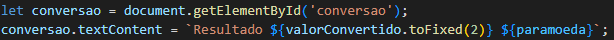

# Projeto Conversor de Moeda 

## ÍNDICE 

* [Introdução](#introdução)
* [Descrição](#descrição)
* [Funcionalidades](#funcionalidades)
* [Resultado](#resultado)
* [Fontes](#fontes)
* [Autora](#autora)
* [Orientador](#orientador)

## `Introdução`

Este projeto tem como objetivo criar uma aplicação web para conversão de moedas usando HTML5, CSS3 e JavaScript puro. A conversão será baseada em taxas fixas definidas no código, sem uso de APIs externas. O foco é desenvolver uma interface simples, funcional e responsiva, aplicando conceitos fundamentais de desenvolvimento web.

## `Descrição`

Este código em JavaScript é responsável por realizar a conversão de moedas de forma dinâmica utilizando um formulário HTML. Ele captura o valor inserido pelo usuário, converte entre moedas com base em taxas fixas e exibe o resultado na página.

* Monitoramento do envio do formulário
O evento 'submit' do formulário com ID 'currency-form' é detectado. Ao enviar o formulário, a função é chamada:

Esta linha evita que a página seja recarregada após o envio, permitindo que a conversão seja processada sem perder o estado da página.

* Obtenção dos dados do formulário

O valor a ser convertido é lido e convertido para número decimal:

As moedas de origem e destino são recuperadas dos campos de seleção do formulário:

* Taxas de câmbio fixas

As taxas de conversão entre três moedas (USD, EUR e BRL) são definidas dentro de um `'objeto'`:

* Cálculo da conversão

Se a moeda de origem e destino forem iguais, o valor permanece inalterado. Caso contrário, a conversão é realizada multiplicando o valor pela taxa correspondente:

* Exibição do resultado

O resultado da conversão é exibido no elemento HTML com ID ``'conversao'``. O valor é formatado com duas casas decimais e acompanhado da moeda de destino:

## `Funcionalidades`

Ao enviar o formulário, ele captura o valor inserido e as moedas selecionadas, calcula a conversão com base nas taxas definidas e exibe o resultado na página sem recarregá-la. Se as moedas de origem e destino forem iguais, o valor permanece inalterado.

## `Resultado`

## `Fontes`

## `Autora`
[Manuela Araujo dos Santos](https://github.com/manuelaaraujo)

### `Orientador`
[Leonardo Rocha](https://github.com/LeonardoRochaMarista)